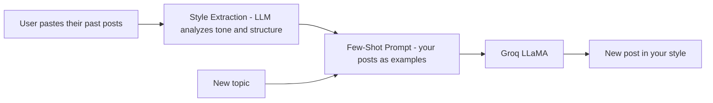
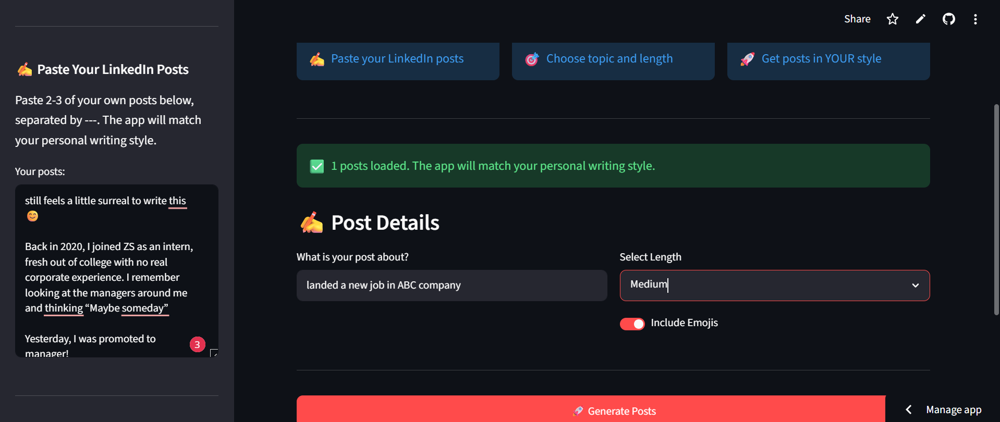
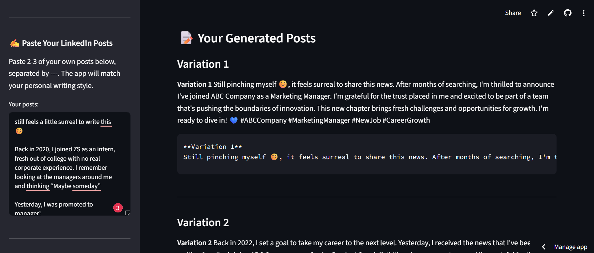

# ✍️ LinkedIn Post Generator — Write in Your Own Voice

An AI app that learns your personal writing style from your past LinkedIn posts and generates new posts that sound like *you* wrote them — using Few-Shot Learning.

## 🚀 Live Demo
**[Try it here](https://linkedin-post-generator-hzzwnbqmyvgw8j6mu5wzjc.streamlit.app/)**

## 📌 The Business Problem
Professionals know that posting consistently on LinkedIn builds their personal brand — but most struggle to write regularly, and generic AI tools produce posts that don't sound like them. **This app captures your unique voice and generates on-brand posts**, removing the blank-page problem while keeping your authentic style.

## 🏗️ Architecture



## ⚙️ How It Works
1. You paste a few of your own LinkedIn posts (separated by `---`)
2. The LLM **extracts your writing style** — tone, structure, length, emoji use
3. Your posts become **few-shot examples** in the prompt
4. You give a new topic → it generates a post matching your style

## ✅ Results / What It Does
- **Style extraction** from your own sample posts via the LLM
- **Few-Shot Learning** — your posts guide the model instead of generic output
- Falls back to default examples if you don't provide your own
- Produces ready-to-post LinkedIn content in your voice

## 📸 Screenshots

**App interface**



**Generated post**



## 🛠️ Tech Stack
- **LLM:** Groq + LLaMA 3.1
- **Technique:** Few-Shot Learning
- **Framework:** LangChain
- **Frontend:** Streamlit

## ▶️ Run Locally
1. Clone the repo:
```
git clone https://github.com/Murtaza-data/linkedin-post-generator.git
cd linkedin-post-generator
```
2. Install dependencies:
```
pip install -r requirements.txt
```
3. Enter your Groq API key in the sidebar
4. Run the app:
```
streamlit run app.py
```
